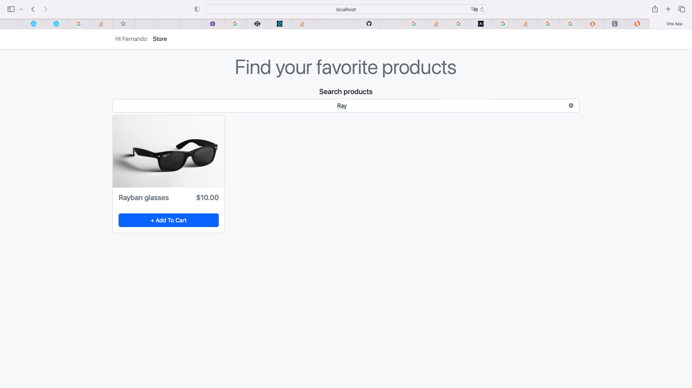

# Simple MVC frontend for store "MVP product"

This repository contains the frontend MVC implementation of a web app connected to [API store](https://github.com/yarn-rp/simple_mvc_backend_app). Please ensure to install first server app available [in here](https://github.com/yarn-rp/simple_mvc_backend_app).

## Hightlights

1. React.js with Typescript and Vite
2. React hooks adn functional components
3. Local DataSource handling 
4. Error validation

## Installation

In the project root folder, run:
```bash
yarn install
```

## Run project

In the project root folder, run:
```bash
yarn run dev
```

React application should be available on http://localhost:3000/. Either way, console should be logged with local url for accessing the app.

## Screenshoots





